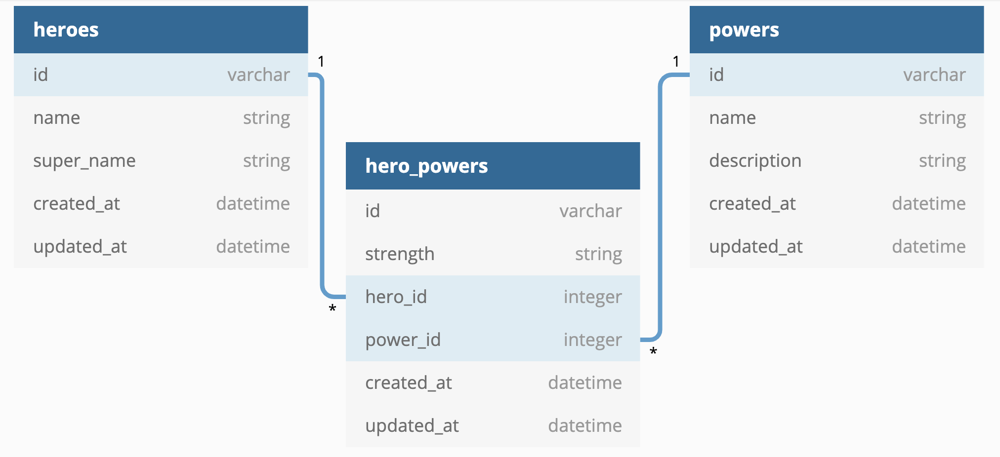

# Flask Code Challenge - Superheroes

This project is a Flask-based API for managing superheroes and their superpowers. The API provides various routes to retrieve and update information about heroes, powers, and their associations.

## Setup

To set up and run the project, follow these steps:

1. Install project dependencies for both the backend and frontend:
   
   ```bash
   pipenv install
   npm install --prefix client
   ```

2. Create the required database tables and seed data:

   - Generate the models and migrations for the database tables.

   - Run the migrations and seed data with the following commands:

   ```bash
   flask db upgrade
   python app/seed.py
   ```


3. Run the Flask API on `localhost:5555`:

   ```bash
   python app.py
   ```

4. Run the React app on `localhost:4000`:

   ```bash
   npm start --prefix client
   ```

## Models

The project includes the following relationships:

- A `Hero` has many `Power`s through `HeroPower`.
- A `Power` has many `Hero`s through `HeroPower`.
- A `HeroPower` belongs to a `Hero` and belongs to a `Power`.

The domain diagram represents the relationships between these models.



The relationships between models have been established in the code, allowing you to manage heroes, powers, and their associations.

## Validations

The project includes the following validations:

- In the `HeroPower` model, `strength` must be one of the following values: 'Strong', 'Weak', 'Average'.
- In the `Power` model, `description` must be present and at least 20 characters long.

These validations help maintain data integrity and ensure data quality within the API.

## Routes

The project provides the following routes to interact with the API:

### GET /heroes

Retrieve a list of heroes in the following JSON format:

```json
[
  { "id": 1, "name": "Kamala Khan", "super_name": "Ms. Marvel" },
  { "id": 2, "name": "Doreen Green", "super_name": "Squirrel Girl" },
  { "id": 3, "name": "Gwen Stacy", "super_name": "Spider-Gwen" }
]
```

### GET /heroes/:id

Retrieve hero information by ID. If the hero exists, the API returns JSON data in the following format:

```json
{
  "id": 1,
  "name": "Kamala Khan",
  "super_name": "Ms. Marvel",
  "powers": [
    {
      "id": 1,
      "name": "super strength",
      "description": "gives the wielder super-human strengths"
    },
    {
      "id": 2,
      "name": "flight",
      "description": "gives the wielder the ability to fly through the skies at supersonic speed"
    }
  ]
}
```

If the hero does not exist, the API returns an appropriate HTTP status code and the following JSON data:

```json
{
  "error": "Hero not found"
}
```

### GET /powers

Retrieve a list of superpowers in the following JSON format:

```json
[
  {
    "id": 1,
    "name": "super strength",
    "description": "gives the wielder super-human strengths"
  },
  {
    "id": 1,
    "name": "flight",
    "description": "gives the wielder the ability to fly through the skies at supersonic speed"
  }
]
```

### GET /powers/:id

Retrieve superpower information by ID. If the superpower exists, the API returns JSON data in the following format:

```json
{
  "id": 1,
  "name": "super strength",
  "description": "gives the wielder super-human strengths"
}
```

If the superpower does not exist, the API returns an appropriate HTTP status code and the following JSON data:

```json
{
  "error": "Power not found"
}
```

### PATCH /powers/:id

Update an existing superpower. The API accepts an object with the following properties in the body of the request:

```json
{
  "description": "Updated description"
}
```

If the superpower exists and is updated successfully (passes validations), the API updates its description and returns JSON data in the following format:

```json
{
  "id": 1,
  "name": "super strength",
  "description": "Updated description"
}
```

If the superpower does not exist, the API returns an appropriate HTTP status code and the following JSON data:

```json
{
  "error": "Power not found"
}
```

If the superpower is **not** updated successfully (does not pass validations), the API returns an appropriate HTTP status code and the following JSON data:

```json
{
  "errors": ["validation errors"]
}
```

### POST /hero_powers

Create a new `HeroPower` that is associated with an existing `Power` and `Hero`. The API accepts an object with the following properties in the body of the request:

```json
{
  "strength": "Average",
  "power_id": 1,
  "hero_id": 3
}
```

If the `HeroPower` is created successfully, the API sends back a response with the data related to the `Hero`:

```json
{
  "id": 1,
  "name": "Kamala Khan",
  "super_name": "Ms. Marvel",
  "powers": [
    {
      "id": 1,
      "name": "super strength",
      "description": "gives the wielder super-human strengths"
    },
    {
      "id": 2,
      "name": "flight",
      "description": "gives the wielder the ability to fly through the skies at supersonic speed"
    }
  ]
}
```

If the `HeroPower` is **not** created successfully, the API returns an appropriate HTTP status code and the following JSON data:

```json
{
  "errors": ["validation errors"]
}
```
